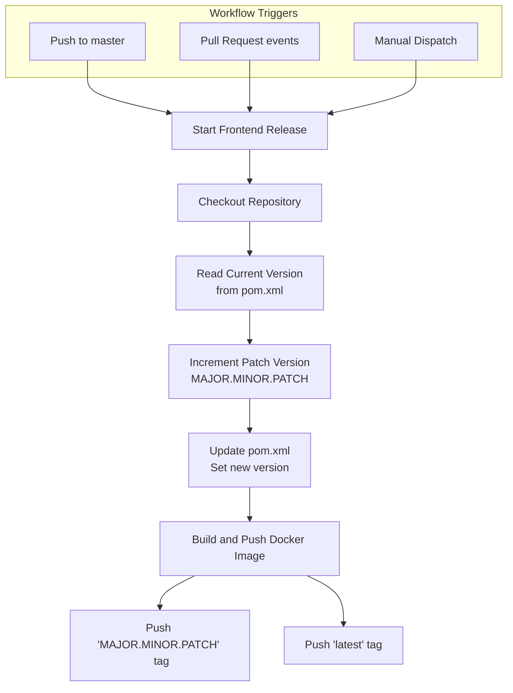
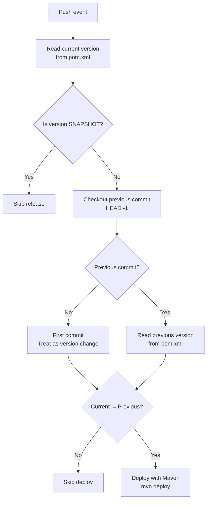

# SMS Checker

This repository contains coursework for the [DevOps for Distributed Apps (CS4295)](https://studyguide.tudelft.nl/courses/study-guide/educations/14776) course at [Delft University of Technology (Netherlands, EU)](https://se.ewi.tudelft.nl/teaching/) by [Dr. Sebastian Proksch](https://proks.ch/). We extend a simple [SMS Checker app](https://github.com/proksch/sms-checker) that identifies whether an SMS message is considered a spam or not (ham). More specifically, we focus on providing the necessary configuration and automation to operate the application and perform continuous experimentation.


## Organization and Repositories

You are currently in the `operation` repository which acts as a central hub from which we can deploy, orchestrate, and monitor the application. Beyond this, we have three other repositories in our organization:

- [`app`](https://github.com/doda2025-team14/app): Hosts the web application frontend (JavaScript) and backend REST API (Spring Boot) that connects users to the `model-service`.
- [`model-service`](https://github.com/doda2025-team14/model-service): Provides the machine learning model (Python) and serves predictions to `app` via a REST API.
- [`lib-version`](https://github.com/doda2025-team14/lib-version): Contains a version-aware Maven library that provides version information to other components.

### Team Members

| Name                    | GitHub Username      | Student Number | Email                                 |
|-------------------------|----------------------|----------------|---------------------------------------|
| Boris Annink            | Borito185            | 5591147        | B.R.M.Annink@student.tudelft.nl       |
| Conall Lynch            | conalllynch2015-a11y | 6182488        | C.J.Lynch@student.tudelft.nl          |
| Wilhelm Marcu           | wmarcu               | 5245788        | W.P.A.Marcu@student.tudelft.nl        |
| Jeffrey Meerovici Goryn | jmeerovici           | 5730783        | J.G.MeeroviciGoryn@student.tudelft.nl |
| Alessandro Valmori      | alevu3344            | 6518885        | A.Valmori@student.tudelft.nl          |

### Additional Documentation

We provide links to other resources for readers who wish to gain a deeper understanding of the project:

- [`docs/deployment`](https://github.com/doda2025-team14/operation/blob/master/docs/deployment.md): For understanding the structure and data flow of the final deployment.
- [`docs/extension`](https://github.com/doda2025-team14/operation/blob/master/docs/extension.md): For gaining insight into the limitations/shortcomings of this project and how to improve upon them in future work.
- [`docs/continuous-experimentation`](https://github.com/doda2025-team14/operation/blob/master/docs/continuous-experimentation.md): For understanding the experimental design and evaluation process used to assess new feature proposals.
- [`docs/activity`](https://github.com/doda2025-team14/operation/blob/master/docs/ACTIVITY.md): For a high level overview of the weekly contributions of each team member
- [`project backlog`](https://github.com/orgs/doda2025-team14/projects/4/views/1): For a detailed collection of issues and merge requests and an insight into the workload distribution.


## Configuration

Configuration is split across three files, each serving as the Single Source of Truth (SSOT) for its domain:

| File | Purpose | Used By |
|------|---------|---------|
| `.env.example` | Container images, ports, service URLs | Docker Compose |
| `chart/values.yaml` | K8s deployments, ingress, hostnames, Istio, Grafana | Helm |
| `Vagrantfile` | VM count, IPs, memory allocation | Vagrant/Ansible |

### Environment Variables

Copy `.env.example` to `.env` and customize as needed.

| Variable | Description | Default |
|----------|-------------|---------|
| `REGISTRY` | Container registry | `ghcr.io/doda2025-team14` |
| `APP_IMAGE_REPO` | App image repository | `${REGISTRY}/app` |
| `APP_IMAGE_TAG_STABLE` | App image tag | `stable` |
| `MODEL_SERVICE_IMAGE_REPO` | Model service repository | `${REGISTRY}/model-service` |
| `MODEL_SERVICE_IMAGE_TAG_STABLE` | Model service tag | `stable` |
| `APP_PORT` | App container port | `8080` |
| `MODEL_SERVICE_PORT` | Model service container port | `8081` |
| `ENABLE_CACHE` | Enable caching feature | `false` |
| `HOST_PORT` | Host port mapping | `8080` |
| `MODEL_HOST` | URL for app to reach model-service | `http://model-service:8081` |
| `MODEL_URL` | Model artifacts download URL | `https://github.com/doda2025-team14/model-service/releases/latest/download/model-release.tar.gz` |

### Helm Chart Values

For Kubernetes deployments, all configuration is in `chart/values.yaml`. Override values with `--set` or a custom values file.

- `app.*` - App deployment, service, ingress configuration
- `modelService.*` - Model service deployment configuration  
- `istio.*` - Istio gateway and virtual service settings
- `grafana.*` - Grafana admin credentials
- `secrets.*` - Secret management options

### Vagrant/Ansible

VM provisioning is configured at the top of the `Vagrantfile`:

```bash
NUM_WORKERS = 2      # Number of worker nodes
BASE_IP = 200        # Base IP (192.168.56.BASE_IP)
```

These values are passed to Ansible playbooks via `extra_vars`.


## Cluster Setup and Provisioning

We provide the necessary configuration to setup a cluster for the application to run in. We support two use cases: Minikube for quick, lightweight testing, and dedicated VMs for more control and flexibility.

### Setting up Minikube

#### Prerequisites

- Minikube
- Kubectl
- Istioctl

#### Instructions

1. Delete current minikube cluster (if present): `minikube delete`
2. Create a new cluster: `minikube start --memory=6144 --cpus=4 --driver=docker`
3. Enable ingress addon: `minikube addons enable ingress`
4. Install Istio to the cluster: `istioctl install -y`

We provide a script `setup-minikube.sh` for ease of use which performs the above instructions.

### Provisioning Virtual Machines

#### Prerequisites
- VirtualBox
- Vagrant
- Ansible

#### Virtual Machine Details

All VMs run on the `bento/ubuntu-24.04` base system. The cluster specification can be found in the [`Vagrantfile`](https://github.com/doda2025-team14/operation/blob/master/Vagrantfile) and consists of:
- A controller `(192.168.56.200)`: 4GB memory, 2 cores
- Variable number of workers (default 2) `(192.168.56.201+)`: 6GB memory, 2 cores

Note: we made the decision to deviate from the standard IP addresses specified in the assignment instructions. Instead of starting from IP address `192.168.56.100`, we start from `192.168.56.200` to avoid a common networking configuration error on the host machine related to a running DHCP server on the same IP.

We use Ansible playbooks to configure the VM software:
- `general.yml`: general configuration applied to all VMs (K8s tools, containerd, networking)
- `ctrl.yml`: extra configuration applied only to the controller (cluster init, Flannel, Helm)
- `node.yml`: extra configuration applied only to the workers (join cluster)
- `flannel.yml`: Flannel CNI network configuration
- `finalization.yml`: post-provisioning setup run from host (MetalLB, Ingress Controller, Dashboard, Istio)


#### Instructions

1. Optional: Place your public SSH key in the `ssh-keys` directory. This will automatically copy your key to each VM during provisioning, allowing you to immediately connect.

2. Run `vagrant up` to create and provision the VMs. This runs `general.yml`, `ctrl.yml`, and `node.yml` automatically.


## Deploying and Running the Application

We provide pre-built images which you can use to run the application. The available images, along with other packages, are published to [GitHub Packages](https://github.com/orgs/doda2025-team14/packages). The workflows of these releases are shown in the *figures* below. The application can be run either through Docker containers or using Kubernetes.

### Image Release Workflows

*Figure 1: Frontend/Model-Service Release Workflow*


*Figure 2: Lib-Version Release Workflow*
### Run using Docker containers

#### Prerequisites

- Docker
- Docker Compose

#### Instructions

 To start the application, run the following command: `docker compose up -d`.

### Run using Kubernetes

#### Prerequisites

- A running cluster (see previous section)
- Helm

#### Instructions

We provide a helm chart in the `/chart` directory for easily deploying the application to a Kubernetes cluster.

If you are running a minikube cluster, you can deploy to it by running:
```bash
helm install <RELEASE_NAME> chart/ --dependency-update
```

If you are running a provisioned VM cluster, there are a few extra steps before you can deploy with helm:

1. Ensure that all of the VMs have spun up and then run the finalization playbook from the host to install cluster services:
   ```bash
   ansible-playbook -i inventory.cfg playbooks/finalization.yml \
     --private-key=.vagrant/machines/ctrl/virtualbox/private_key \
     -e 'ansible_ssh_common_args="-o StrictHostKeyChecking=no"' \
     -u vagrant --limit ctrl
   ```

2. Export the `KUBECONFIG`:
   ```bash
   export KUBECONFIG=./shared/admin.conf
   ```

3. Merge the cluster's `KUBECONFIG` with the local one:
   ```bash
   KUBECONFIG=~/.kube/config:./shared/admin.conf \
   kubectl config view --raw --flatten > ~/.kube/config.tmp && \
   mv ~/.kube/config.tmp ~/.kube/config
   ```

4. Change kubectl context to the cluster:
   ```bash
   kubectl config use-context kubernetes-admin@kubernetes
   ```

5. Deploy the application using Helm:
   ```bash
   helm install <RELEASE_NAME> chart/ --dependency-update
   ```

We provide a script `deploy-to-vms.sh` for ease of use which performs the above instructions. Make sure to run the script using `source deploy-to-vms.sh` for the export command to work correctly.


## Using the Application

Once the application is running, you can access it either through the ingress (`192.168.56.93`) or through the Istio gateway (`192.168.56.94`). Note: if running on minikube, the IPs will likely be different so verify which external IP is assigned using:
```bash
kubectl get svc -n istio-system
kubectl get svc -n ingress-nginx
```

The root endpoint defaults to the `/sms` endpoint which where SMS messages can be submitted to the machine learning model for evaluation. For detailed documentation of all available services and endpoints, as well as the architectural design of the entire system, please see [`docs/deployment`](https://github.com/doda2025-team14/operation/blob/master/docs/deployment.md).


<!-- ## Monitoring

### Metrics

- The metrics page can be accessed in plaintext via `http://<app_url>/metrics`.
- This endpoint is scraped by Prometheus to collect data regarding:
-- Ham/Spam Identification
-- Total Active Users
-- Latency Distribution

- Prometheus defaults to port 9090 and you can port-forward this to your local machine using `kubectl port-forward svc/<RELEASE_NAME>-kube-promet-prometheus 9090:9090`
- You can query the following to get their related metrics ({} -> Optional Arguments):
-- frontend_sms_requests_total{status="success",result="ham"}: Count of messages identified as "Ham" (i.e., not Spam)
-- frontend_sms_requests_total{status="success",result="spam"}: Count of messages identified as "Spam"
-- frontend_active_users: Total number of active users (within the last 5 mins)
-- frontend_prediction_latency_seconds_bucket{status="success",le="0.1"/"0.2"/"0.5"}: Latency Historgram regions
-- frontend_prediction_latency_seconds_count{status="success"}: total requests
-- frontend_prediction_latency_seconds_sum{status="success"}: "total" latentcy (combine with above to get average)

- To add more metrics, add a collection mechanism to FrontendController and append the output String of MetricsController to export it.

### Alerting -->

