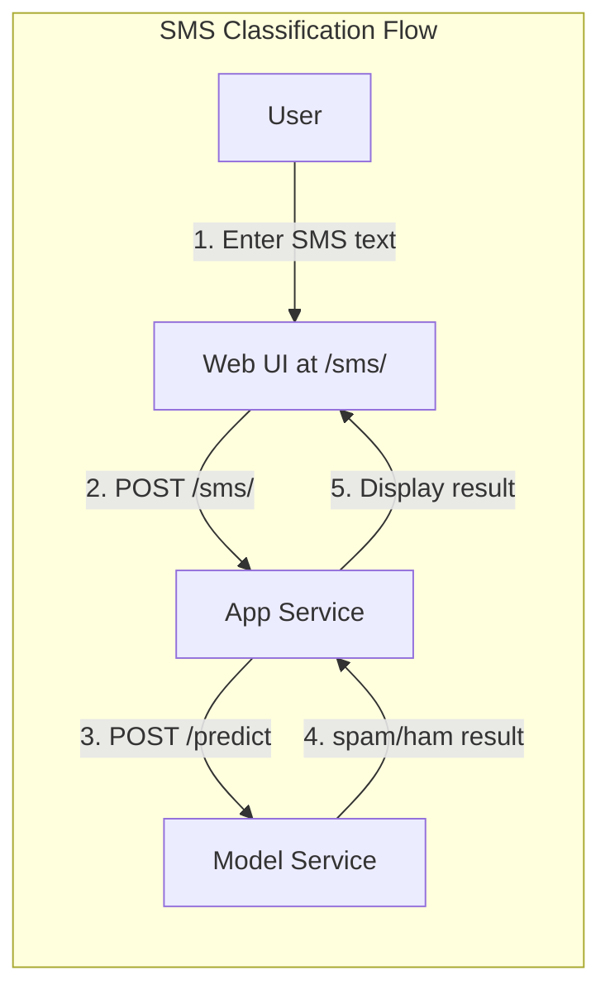
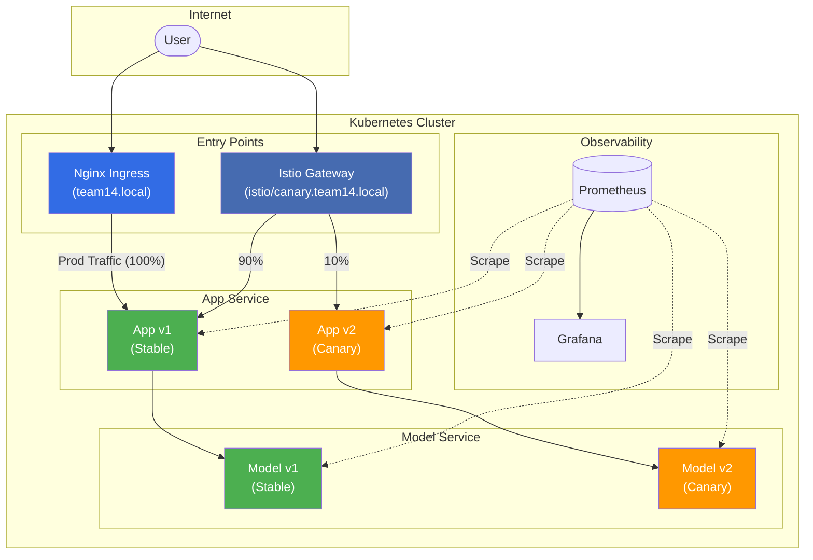
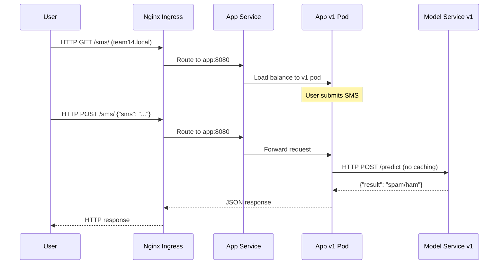
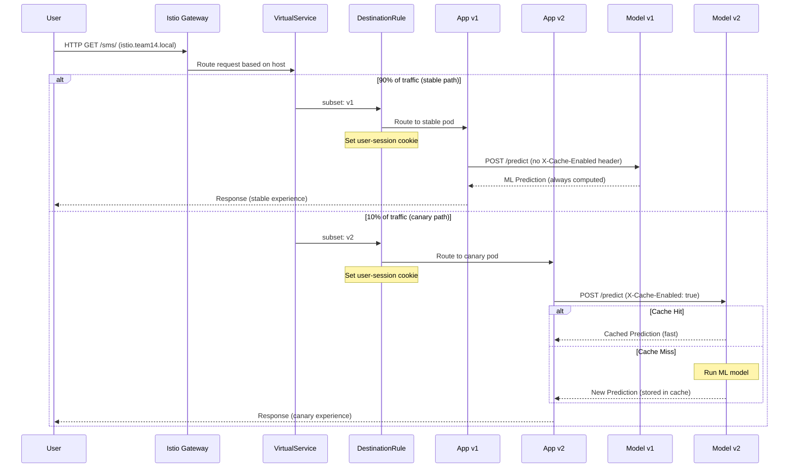
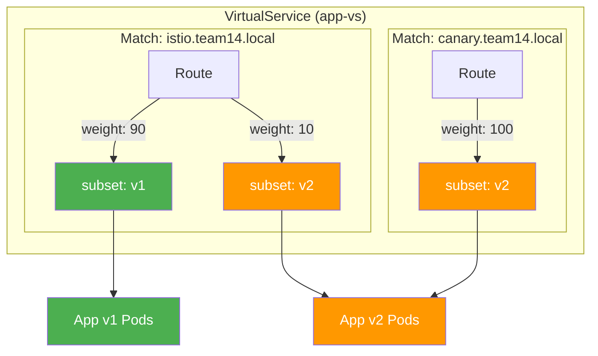
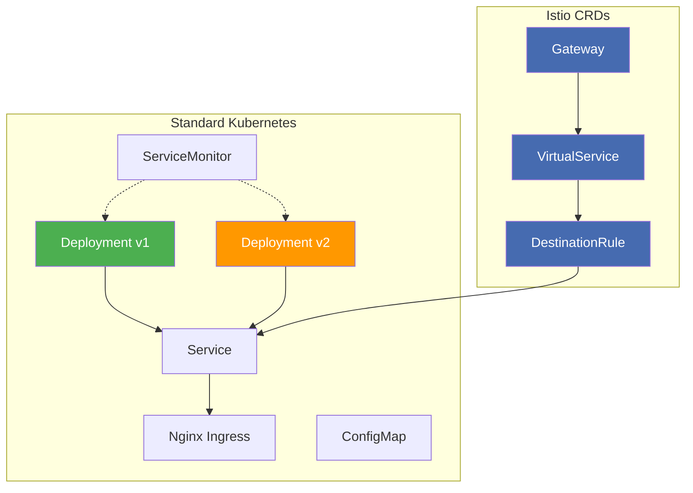
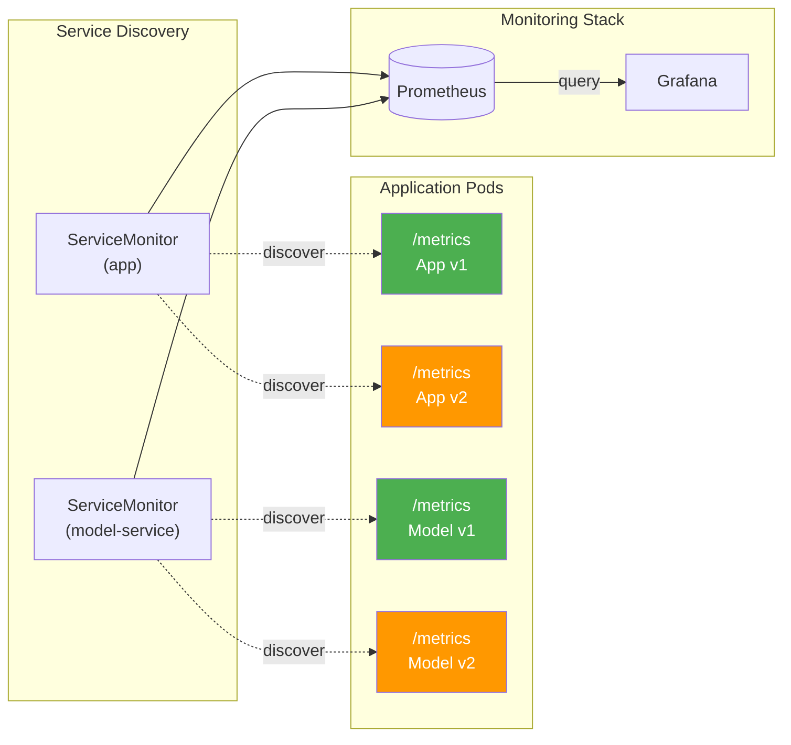

# SMS Checker: Deployment Architecture

This document details the architectural topology, traffic routing strategies, and observability stack for the SMS Checker application. It serves as a reference for understanding how the stable (v1) and canary (v2) environments coexist and how continuous experimentation is implemented.

## Table of Contents

- [SMS Checker: Deployment Architecture](#sms-checker-deployment-architecture)
  - [Table of Contents](#table-of-contents)
  - [1. System Context \& Capabilities](#1-system-context--capabilities)
    - [Data Flow](#data-flow)
    - [Version Strategy](#version-strategy)
  - [2. High-Level Topology](#2-high-level-topology)
  - [3. Traffic Routing Strategies](#3-traffic-routing-strategies)
    - [3.1. Access Points \& Behavior](#31-access-points--behavior)
    - [3.2. Detailed Request Flows](#32-detailed-request-flows)
      - [Path A: Production (Stable)](#path-a-production-stable)
      - [Path B: A/B Experiment (Canary)](#path-b-ab-experiment-canary)
    - [3.3. Advanced Routing Mechanics](#33-advanced-routing-mechanics)
      - [Sticky Sessions](#sticky-sessions)
      - [Version Consistency](#version-consistency)
      - [VirtualService Routing Logic](#virtualservice-routing-logic)
  - [4. Kubernetes Resources](#4-kubernetes-resources)
    - [Resource Relationships](#resource-relationships)
    - [Pod Labeling Strategy](#pod-labeling-strategy)
    - [Internal Service Communication](#internal-service-communication)
  - [5. Observability Stack](#5-observability-stack)
    - [Architecture](#architecture)
    - [Metrics Collection](#metrics-collection)
    - [Dashboards](#dashboards)
  - [6. Developer Reference](#6-developer-reference)
    - [DNS Setup](#dns-setup)
    - [Endpoints](#endpoints)
      - [Application API Endpoints](#application-api-endpoints)
    - [Configuration Management](#configuration-management)
      - [Canary Weight Configuration](#canary-weight-configuration)
      - [Secrets Management](#secrets-management)

---

## 1. System Context & Capabilities

The SMS Checker is a web application that classifies SMS messages as **spam** or **ham** (legitimate) using a machine learning model. The system consists of two main services:

- **App (Frontend)**: A Spring Boot application serving a web UI and REST API
- **Model Service**: A Python Flask service hosting the ML classification model

### Data Flow

The system follows a standard request-response pattern:



1. **User** submits text via the Web UI (`/sms/`).
2. **App Service** (Spring Boot) receives the request.
3. **Model Service** (Python Flask) performs ML inference.
4. **Result** is returned to the user.

This flow is identical for both v1 and v2; the difference lies in the internal caching behavior of v2.

### Version Strategy

To support Continuous Experimentation, two versions of the application run simultaneously:

| Feature | **v1 (Stable)** | **v2 (Canary)** |
| :--- | :--- | :--- |
| **Logic** | Direct ML processing | Adds **In-Memory Caching** |
| **Goal** | Baseline performance | Test latency reduction & resource usage |
| **Configuration** | Standard | `CACHE_MAX_SIZE=1000`, `CACHE_TTL=3600s` |
| **Behavior** | Always computes prediction | Returns cached result if hash matches |
| **Header** | None | App sends `X-Cache-Enabled: true` |

The caching mechanism uses a SHA-256 hash of the SMS content as the cache key, with FIFO eviction when the cache exceeds its maximum size. See [continuous-experimentation.md](./continuous-experimentation.md) for the full experimental design and hypothesis.

---

## 2. High-Level Topology

The following diagram illustrates the complete system topology, showing how external traffic enters the cluster and routes to specific service versions.



- **Nginx Ingress:** provides the stable production endpoint, always routing to v1 components (green).
- **Istio Gateway:** enables experimentation with weighted traffic splitting (90/10).
- **Prometheus:** scrapes metrics from all pods; **Grafana** visualizes the data.

---

## 3. Traffic Routing Strategies

The system exposes three distinct entry points.

### 3.1. Access Points & Behavior

| Hostname | Entry Controller | Routing Logic | Use Case |
| :--- | :--- | :--- | :--- |
| **`team14.local`** | Nginx Ingress | **100% Stable (v1)**. Bypasses Istio routing logic. | Production / Baseline |
| **`istio.team14.local`** | Istio Gateway | **90% Stable / 10% Canary**. Managed by VirtualService weights. | A/B Testing |
| **`canary.team14.local`** | Istio Gateway | **100% Canary (v2)**. | Dev / Verification |

### 3.2. Detailed Request Flows

#### Path A: Production (Stable)

Users on `team14.local` are guaranteed a consistent experience without experimental features.




#### Path B: A/B Experiment (Canary)

Users on `istio.team14.local` participate in the experiment:



The VirtualService performs weighted routing (90% v1, 10% v2), and the DestinationRule sets a session cookie to maintain user stickiness.

### 3.3. Advanced Routing Mechanics

#### Sticky Sessions

To ensure consistent user experience during an experiment, sticky sessions are enabled via `DestinationRule`:

```yaml
trafficPolicy:
  loadBalancer:
    consistentHash:
      httpCookie:
        name: "user-session"
        ttl: "0s"  # Session cookie (expires on browser close)
```

Once a user is assigned to v1 or v2, they remain on that version for their session.

#### Version Consistency

It is critical that App v2 *only* talks to Model v2 to test the caching logic end-to-end. To accomplish this the Model Service' VirtualService uses Istio's `sourceLabels` matching:

1. The App pod has a label `version: v1` or `version: v2`
2. The Istio sidecar (Envoy) intercepts outgoing requests to `model-service`
3. The VirtualService matches `sourceLabels.version` from the calling pod
4. Traffic is routed to the corresponding model-service subset (v1 $\rightarrow$ v1, v2 $\rightarrow$ v2)

This ensures that when testing the caching experiment, users get the complete experimental stack.

#### VirtualService Routing Logic

The App VirtualService implements host-based routing with weighted splits:



Requests to `istio.team14.local` enter the weighted routing block (90% v1, 10% v2). Requests to `canary.team14.local` bypass the split entirely and route 100% to v2, useful for developers who need to test the canary version directly.

---

## 4. Kubernetes Resources

The deployment is managed via Helm. Below is the relationship between Kubernetes native resources and Istio Custom Resource Definitions (CRDs).

### Resource Relationships



Standard Kubernetes resources like (Deployments, Services, Ingress, ConfigMap) handle the core application deployment. An Istio CRDs (Gateway, VirtualService, DestinationRule) layer on top provide traffic management without modifying the underlying Kubernetes resources.

### Pod Labeling Strategy

Istio relies on labels to distinguish subsets for routing:

| Component | Deployment | Labels | Image Tag |
| :--- | :--- | :--- | :--- |
| **App** | Stable | `app: app`, `version: v1` | `stable` |
| **App** | Canary | `app: app`, `version: v2` | `experimental` |
| **Model** | Stable | `app: model-service`, `version: v1` | `stable` |
| **Model** | Canary | `app: model-service`, `version: v2` | `experimental` |

### Internal Service Communication

Services communicate within the cluster using Kubernetes DNS:

| From | To | URL | Protocol |
|------|----|-----|----------|
| App | Model Service | `http://model-service:8081/predict` | HTTP |
| Prometheus | App | `http://app:8080/metrics` | HTTP |
| Prometheus | Model Service | `http://model-service:8081/metrics` | HTTP |
| Prometheus | Model Service | `http://model-service:8081/cache` | HTTP |

---

## 5. Observability Stack

We utilize a Prometheus/Grafana stack to monitor the cluster.

### Architecture



- **Discovery:** `ServiceMonitor` resources automatically detect pods matching the configured label selectors.
- **Scraping:** Prometheus scrapes `/metrics` on all pods (App v1/v2 and Model v1/v2).
- **Visualization:** Grafana queries Prometheus and renders dashboards.

### Metrics Collection

Both services expose Prometheus metrics at the `/metrics` endpoint:

- **App**: Request counts, latencies, classification results (ham/spam probability)
- **Model Service**: Prediction counts, model inference times, cache statistics (v2)

### Dashboards

Two dashboards are automatically provisioned via ConfigMap sidecar:

1. **App Dashboard** ([`dashboards/app-dashboard.json`](../chart/dashboards/app-dashboard.json)): General health metrics including ham/spam probability distribution, prediction latency histograms, and request throughput.

2. **Experiment Dashboard**: Experiment visualization is yet to be created.

---

## 6. Developer Reference

### DNS Setup

To interact with the cluster locally, update your `/etc/hosts` file:

```bash
# Locate LoadBalancer IPs
kubectl get svc -n ingress-nginx    # Nginx IP
kubectl get svc -n istio-system     # Istio Gateway IP

# /etc/hosts Configuration
<NGINX_IP>   team14.local dashboard.local
<ISTIO_IP>   istio.team14.local canary.team14.local
```

### Endpoints

| URL | Description |
| :--- | :--- |
| `http://team14.local/sms/` | **Main UI** (Production - always v1) |
| `http://istio.team14.local/sms/` | **A/B Test UI** (90% v1 / 10% v2) |
| `http://canary.team14.local/sms/` | **Canary UI** (always v2) |
| `https://dashboard.local` | Kubernetes Dashboard (TLS) |
| `localhost:3000` | Grafana (requires port-forward) |

```bash
kubectl port-forward svc/prometheus-grafana -n team14 3000:80
```

Then navigate to `http://localhost:3000`.


#### Application API Endpoints

| Path | Method | Description | Component |
|------|--------|-------------|-----------|
| `/` | GET | Redirect to `/sms/` | App |
| `/sms/` | GET | Web UI for SMS classification | App |
| `/sms/` | POST | Submit SMS for classification (JSON: `{"sms": "..."}`) | App |
| `/version` | GET | Returns app version | App |
| `/metrics` | GET | Prometheus metrics | App |
| `/predict` | POST | ML classification (internal only) | Model Service |
| `/version` | GET | Returns model service version | Model Service |

### Configuration Management

Configuration is managed through distinct files, each authoritative for its domain:

| File | Scope | Key Settings |
|------|-------|--------------|
| [`chart/values.yaml`](../chart/values.yaml) | Kubernetes/Helm | Hostnames, replicas, Istio weights, Grafana |
| [`.env`](../.env.example) | Docker Compose | Images, ports, service URLs (local dev) |
| [`Vagrantfile`](../Vagrantfile) | VM Provisioning | Worker count, IPs, memory |

#### Canary Weight Configuration

The canary weights are defined in [`chart/values.yaml`](../chart/values.yaml):

```yaml
istio:
  canary:
    enabled: true
    v1Weight: 90
    v2Weight: 10
```

#### Secrets Management

The Helm chart supports two modes:

1. **Pre-deployed secrets** (recommended for production):
   ```yaml
   secrets:
     create: false
     name: app-secrets
   ```

2. **Chart-managed secrets** (for development):
   ```yaml
   secrets:
     create: true
     data:
       apiKey: "..."
   ```
