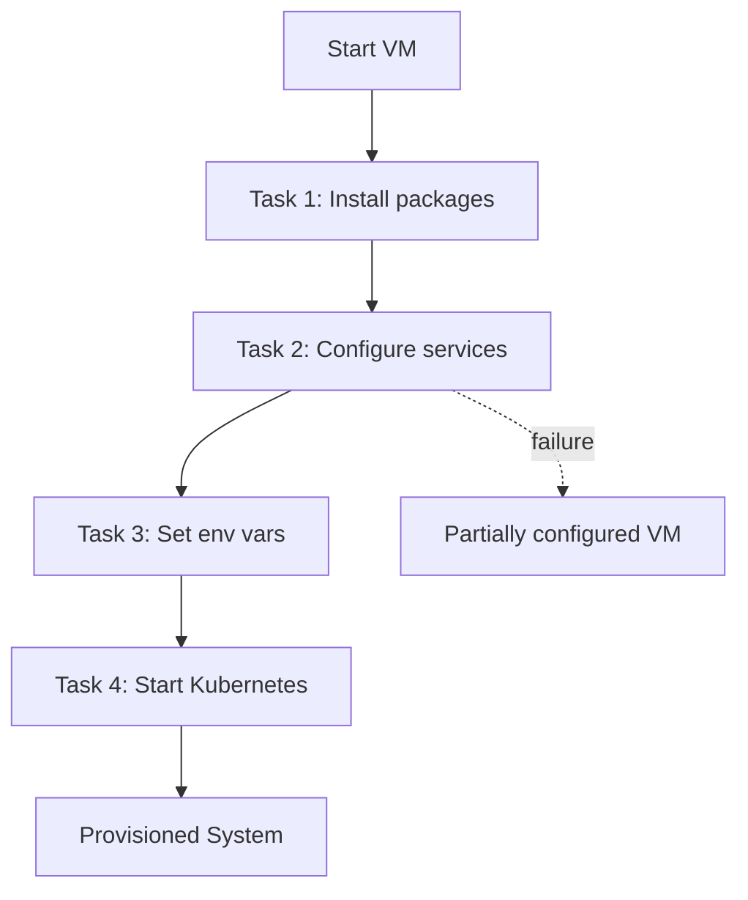
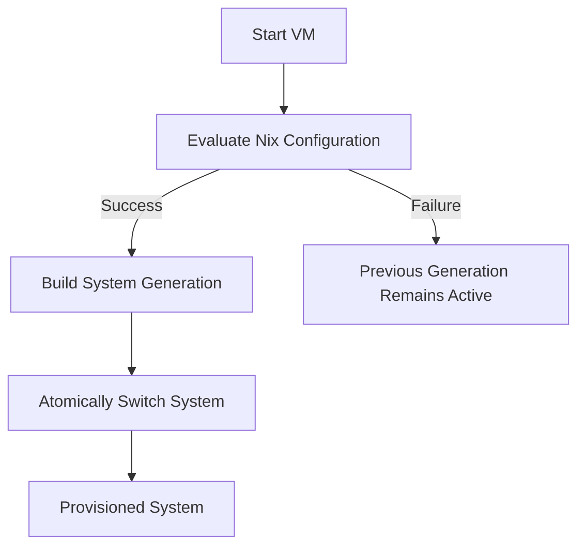

# Extension Proposal: Declarative Provisioning

## Motivation
Infrastructure as Code (IaC) is considered an important aspect of release engineering for achieving consistent and reproducible deployments. Our project uses IaC throughout, ranging from specifying Kubernetes manifests and Helm charts, to defining release workflows and provisioning VMs with Vagrant and Ansible. Among these tools, Ansible is the only one that follows an imperative IoC approach, which is inconsistent with the declarative nature of the rest of our infrastructure. Imperative IaC, in general, tends to be less predictable and more error-prone than declarative approaches, since changes are applied sequentially rather than defined in terms of a desired end state [[1]][imp-vs-dec-iac].

A recurring pain point throughout the development process was extending the Ansible playbooks to configure additional software and environment variables on the provisioned VMs. Incrementally updating the playbooks proved to be a slow and tedious process, as adding a new feature required sitting through the provisioning process, up to five minutes, to reach a state from which development could begin. Furthermore, Ansible does not update the VMs in an atomic way, meaning that when a playbook failed midway, the VM was left in an inconsistent, partially configured state. Since there is no rollback mechanism, recovering from such a situation often required deleting the VM and starting over which, wasted time and disrupted development workflows. Moreover, Ansible does not provide true reproducibility due to its imperative nature; it attempts to converge on a desired state but does not actually guarantee congruence [[2]][ansible-convergance]. Collectively, these limitations make developing, maintaining, and iterating on Ansible playbooks cumbersome, time-consuming, and prone to human error.


*Figure 1: High Level Diagram of Ansible Updates, There is Always the Possibility of a Quiet Failure*


## Proposed Solution: NixOS
To address these shortcomings, we propose replacing the Ubuntu VMs and Ansible playbooks with NixOS VMs and a declarative Nix configuration. NixOS is a Linux distribution built on the Nix package manager which takes a purely functional and declarative approach to system configuration [[3]]. All system details, including permissions, network settings, packages, and program configuration, can be declared and applied all at once without needing to worry about the exact order of steps required to achieve the desired state. This provides a layer of abstraction for the entire provisioning process with stronger guarantees about correctness and reproducibility.

Furthermore, NixOS is an immutable operating system meaning that changes to the system configuration do not mutate the existing state but instead produce a new snapshot of the system called a 'generation'. This process is entirely atomic: either Nix can successfully evaluate the configuration and apply it immediately, or evaluation fails and the system remains in the previous working version. Consequently, the problem of Ansible sometimes producing a partially configured VM is no longer a concern. Each system generation is also saved which provides an efficient rollback mechanism.



*Figure 2: NixOS Updates VMs Atomically, Preventing Quiet Failures Seen With Ansible*


## Refactoring Strategy
We present a list of tasks required to switch from Ansible to NixOS:

**Task 1: Setup Nix Flake Structure:** Create a `flake.nix` file at the root of the `operation` repository. This file will define the inputs (NixOS version and other dependencies) and outputs (the NixOS configurations for the control plane and worker nodes). Flakes provide a standardised way to manage Nix projects and ensure reproducibility by pinning all dependencies and their version information in a `flake.lock` file.

**Task 2: Create NixOS Modules for Control Plane and Worker Nodes:** Create two files `ctrl.nix` and `node.nix` which will contain the declarative configuration for each type of node.

**Task 3: Translate Playbook Logic into Nix:** The configuration required for each node type in the cluster is specified in steps 1-17 as described in [A2: Provisioning a Kubernetes Cluster](https://brightspace.tudelft.nl/d2l/le/content/774572/viewContent/4646349/View). These steps need to be performed in the Nix configuration language rather than sequenced Linux commands in an Ansible playbook. Tools such as [MyNixOS](https://mynixos.com/) can be used to look up individual packages and options available in NixOS. For example, installing software or tools requires adding them to the `environment.systemPackages` list in the NixOS configuration.

**Task 4: Update Vagrantfile:** Modify the `Vagrantfile` to use a generic NixOS base box instead of the current Ubuntu box. The provisioning step also needs to be updated to apply the NixOS configuration by running the following command:
```
nixos-rebuild switch --flake .#<hostname>
```
where <hostname> is either `ctrl` or `node-1`, `node-2`, etc.


## Expected Outcome and Evaluation
The expected outcomes of this change are that the provisioning process will be more reliable with atomic updates, instant rollbacks, and true reproducibility. Moreover, the system configuration will be naturally idempotent because it is enforced globally by design. This is in contrast to Ansible's idempotency where the developer has to go out of their way to ensure correct task ordering, appropriate use of conditionals, and accurate state checks in each playbook.

We also expect significantly faster provisioning times and iteration cycles since Nix understands the full dependency graph of the entire system and only rebuilds parts that have actually changed. To test this hypothesis, we design a small controlled experiment to compare the old and new provisioning systems across two key metrics:

**Metric 1: Initial Provisioning Time:** Measures the time required to provision a full three-node Kubernetes cluster (one control plane, two worker nodes) from scratch using both Ansible and NixOS. We expect the initial NixOS build time to be comparable to the Ansible provisioning time as both need to freshly download and install the required packages.

**Metric 2: Configuration Update Time:** Measures the time required to apply a small change, such as updating the version of a single package, to an already provisioned cluster. For Ansible, this involves modifying the playbook and re-running it on all nodes. For NixOS, this involves modifying the Nix configuration and running the `nixos-rebuild switch` command on all nodes. We expect NixOS to be significantly faster than running the playbooks.


## Assumptions and Potential Drawbacks
While this proposal offers significant benefits, it is important to acknowledge the underlying assumptions and potential downsides. The first is that there is a steep learning curve associated with NixOS. The Nix language is a purely functional, lazily evaluated language which can be challenging for developers accustomed to imperative scripting languages. Consequently, some additional time would be required for the development team to adjust to these changes. This reduces productivity and effectiveness in the short term but pays off in the long run with increased reliability, speed, and reproducibility.

Another concern with adopting NixOS as a solution for declarative provisioning is package availability. While the `Nixpkgs` repository is one of the largest and most up-to-date package repositories in the Linux ecosystem, there might be rare cases where a specific or obscure tool is not yet packaged for Nix. In such cases, we would need to write our own Nix derivation for it which requires advanced knowledge. However, for the common tools used in the project (Kubernetes, containerd, Helm, MetalLB, etc.), high-quality Nix packages are readily available and well-maintained.


## Sources
[imp-vs-dec-iac]: https://www.graphapp.ai/blog/declarative-vs-imperative-iac-understanding-the-key-differences
[1]: Davis, Tyler. (2025). [*Declarative vs Imperative IaC: Understanding the Key Differences*](https://www.graphapp.ai/blog/declarative-vs-imperative-iac-understanding-the-key-differences). Graph.

[ansible-convergance]: https://flyingcircus.io/en/about-us/blog-news/details-view/thoughts-on-systems-management-methods
[2]: Kauhaus, Christian. (2016). [*Thoughts on Systems Management Methods*](https://flyingcircus.io/en/about-us/blog-news/details-view/thoughts-on-systems-management-methods). Flying Circus.

[nixos-paper]: https://edolstra.github.io/pubs/nixos-jfp-final.pdf
[3]: Dolstra, Eelco and Löh, Andres and Pierron, Nicolas (2016). [*NixOS: A Purely Functional Linux Distribution*](https://edolstra.github.io/pubs/nixos-jfp-final.pdf).